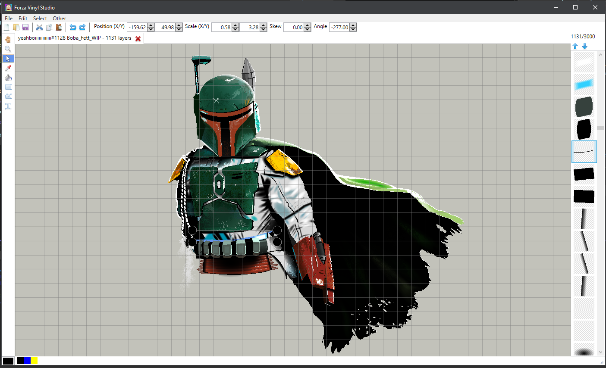

# Forza Vinyl Studio

**PROJECT PAUSED INDEFINITELY. Due to real life happenings I may not be able to work on this for at least a year or more. Sorry for any disapointment. Feel free to clone the project, reuse code, etc if you want to.**

~~**Currently very early in development! This is not in a usable state yet.** However, you can check out my (slow) progress here: <https://trello.com/b/ZPCD6ELp/forza-vinyl-studio>~~

## For users

[Download the latest release here](https://github.com/willn05/forza-vinyl-studio/releases)

### What is this?

This program is supposed to be a direct upgrade to replace Forza Horizon 5's vinyl group editor, so you never have to touch it again. It works in conjunction with [forza painter](https://github.com/forza-painter/forza-painter).

### How do I use it?

Simply open `ForzaVinylStudio.exe` and start placing and modifying shapes. When you're done, you can export it as a json file which from there forza-painter can handle.

TODO video demonstration

## For developers

All contributions are very welcome! I intend to keep the codebase simple and readable as possible so anyone can jump in and start writing code. Assuming Windows 10+, you (should) be able to simply clone this repository and open the .sln file with Visual Studio without any further hassle.

Currently using:

- [Visual Studio Community 2022](https://visualstudio.microsoft.com/vs/)
- [ReSharper](https://www.jetbrains.com/resharper/) for clean C#
- [XAML Styler](https://github.com/Xavalon/XamlStyler/) for clean XAML
- [.NET 6](https://dotnet.microsoft.com/en-us/download/dotnet/6.0)
- [WPF](https://github.com/dotnet/wpf) as our GUI framework
- [CommunityToolkit.Mvvm](https://www.nuget.org/packages/CommunityToolkit.Mvvm/) as our MVVM framework.
- [SkiaSharp](https://github.com/mono/SkiaSharp) and [OpenTK.GLWpfControl](https://www.nuget.org/packages/OpenTK.GLWpfControl/) for fast rendering.
- [Extended WPF Toolkit™ by Xceed](https://github.com/xceedsoftware/wpftoolkit) for handy dandy controls.

You might notice some questionable coding practices being used (global static variables, viewmodels being aware of views), this is just my personal preference to keep the code simple and convenient to write. If this offends you, I'm sorry! 😅

## Other

- [Fugue Icons](https://p.yusukekamiyamane.com/)
Used under [Creative Commons Attribution 3.0 License](http://creativecommons.org/licenses/by/3.0/)

### Thanks

`A-Dawg#0001` for creating [forza painter](https://github.com/forza-painter/forza-painter), which this project relies on.

`D3FEKT#1337` for their [Modelbin template script for 010 Editor](https://discord.com/channels/457063425005191168/741590637773717526/971453916661284964), this project likely wouldn't have been possible without it.
